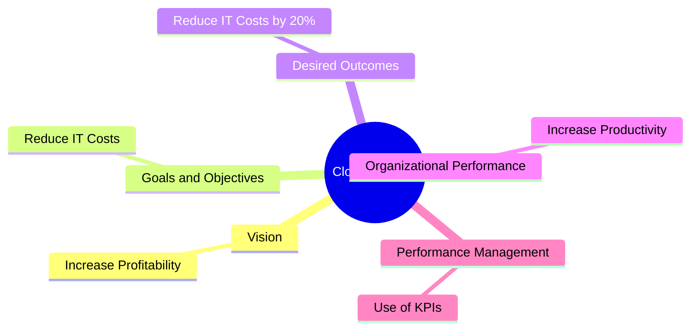

# 10 Question to help define Cloud Strategy (claude.ai)
According to Gartner "a cloud strategy is a concise point of view on the role of the cloud within the organisation. It is a living document  designed to bridge between  a high level corporate strategy and a cloud implementation/adoption/migration plan"

Here are 10 key questions that, when answered, should help you develop a concise cloud strategy document:

1. What role should cloud computing play in our organization's overall business strategy and objectives?
2. How will cloud adoption align with and support our core business values and competitive advantages?
3. What are our primary motivations for moving to the cloud (e.g., cost reduction, scalability, innovation, etc.)?
4. What types of workloads and data are suitable for the cloud, and which should remain on-premises?
5. What is our stance on public, private, and hybrid cloud models? Which aligns best with our business needs and risk tolerance?
6. How will cloud adoption impact our current IT governance model and organizational structure?
7. What are the key risks and challenges we anticipate in our cloud journey, and how do we plan to address them at a high level?
8. How will we measure the success of our cloud initiatives in terms of business value?
9. What is our high-level approach to ensuring security and compliance in the cloud?
10. How does our cloud strategy support and enable our long-term technology vision and digital transformation goals?

By answering these questions, you should be able to create a concise document that outlines your organization's perspective on cloud computing, its role in your business, and how it aligns with your overall corporate strategy. This document can then serve as a bridge to more detailed implementation and migration plans.

